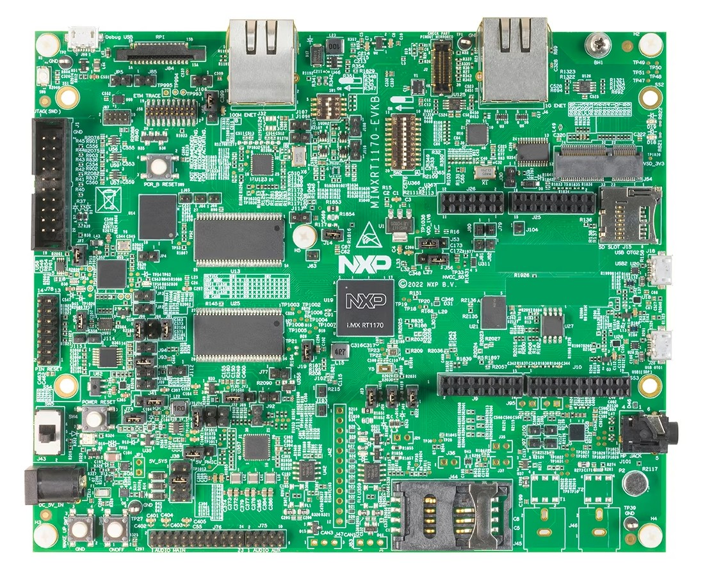
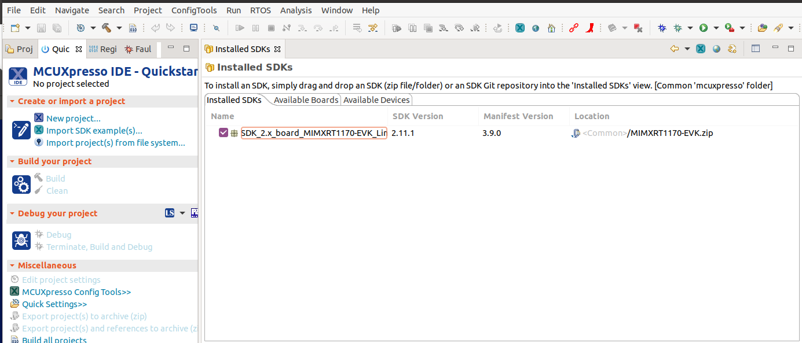
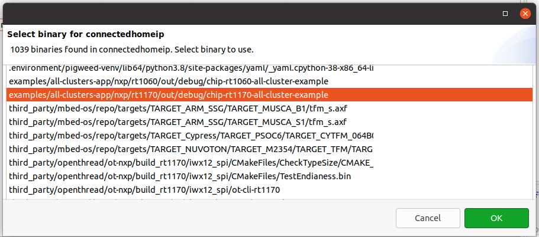

# CHIP RT1170 All-clusters Application

The all-clusters example implements a server which can be accesed by a CHIP controller and can accept basic cluster commands.

The example is based on
[Project CHIP](https://github.com/project-chip/connectedhomeip) and the NXP RT1170 SDK,
and provides a prototype application that demonstrates device commissioning and different cluster
control.


<hr>

-   [CHIP RT1170 All-cluster Application](#chip-RT1170-all-cluster-application) 
-   [Introduction](#introduction)
-   [Application UI](#application-ui)
-   [Building](#building)
-   [Manufacturing data](#manufacturing)
-   [Flashing and debugging](#flashdebug)
-   [Testing the example](#testing-the-example)
-   [Matter Shell](#matter-shell)

<hr>

<a name="intro"></a>

## Introduction



The RT1170 all-cluster application provides a working demonstration of the
RT1170 board integration, built using the Project CHIP codebase and the NXP
RT1170 SDK. The example supports basic ZCL commands and acts as a thermostat device-type.

The example supports:

- Matter over openthread. For that follow instructions from [README_Openthread.md][README_Openthread.md].

[README_Openthread.md]: README_Openthread.md

- Matter over Wifi. For that follow instructions from [README_Wifi.md][README_Wifi.md].

[README_Wifi.md]: README_Wifi.md

The example targets the
[NXP MIMXRT1170-EVK](https://www.nxp.com/design/development-boards/i-mx-evaluation-and-development-boards/i-mx-rt1170-evaluation-kit:MIMXRT1170-EVK)
board by default.


<a name="building"></a>

## Building

In order to build the Project CHIP example, we recommend using a Linux
distribution (the demo-application was compiled on Ubuntu 20.04).

- Follow instruction in [BUILDING.md](../../../../../docs/guides/BUILDING.md) to setup the environement to be able to build Matter.

-   Download the [IMXRT1170 SDK](https://mcuxpresso.nxp.com/).
  Creating an nxp.com account is required before being able to download the
  SDK. Once the account is created, login and follow the steps for downloading
  SDK. The SDK Builder UI selection should be similar with the one from the image below with the **FreeRTOS component**, the **BT/BLE component** and the **ARM GCC Toolchain** selected.


Please refer to release notes for getting the latest released SDK.

Note: if the IWX12 transceiver is chosen a dedicated SDK with this support should be chosen.

-   Start building the application

```
user@ubuntu:~/Desktop/git/connectedhomeip$ export NXP_SDK_ROOT=/path/to/previously/downloaded/SDK
user@ubuntu:~/Desktop/git/connectedhomeip$ source ./scripts/activate.sh
user@ubuntu:~/Desktop/git/connectedhomeip$ cd examples/all-cluster/nxp/rt/rt1170/
```

Optional GN options that can be added when building an application:

- To enable the [matter CLI](README.md#matter-shell), the argument ```chip_enable_matter_cli=true``` must be added to the *gn gen* command.
- To switch the SDK type used, the argument ```is_<sdk_type>=true``` must be added to the *gn gen* command (with <sdk_type> being either sdk_package or sdk_internal).
- To build the application in debug mode, the argument ```is_debug=true optimize_debug=false``` must be added to the *gn gen* command.
- To build with the option to have Matter certificates/keys pre-loaded in a specific flash area the argument ```chip_with_factory_data=1``` must be added to the *gn gen* command. (for more information see [Guide for writing manufacturing data on NXP devices](../../../../platform/nxp/doc/manufacturing_flow.md).

Refer to the Building section in wi-fi or openthread specific README file.

<a name="hardware"></a>

## Hardware requirements for RT1170 and IWX12

Host part:
- 1 EVK-MIMXRT1170

Transceiver part :
- 1 WIFI IWX12 BOARD RD USD

### Hardware rework for SPI support on EVK-MIMXRT1170

To support SPI on the EVK-MIMXRT1170 board, it is required to remove 0Ω resistors R404,R406,R408.

### Board settings (Spinel over SPI, BLE over UART)

The below table explains pin settings (SPI settings) to connect the evkmimxrt1170 (host) to a IWX12 transceiver (rcp).
Note, for the RESET, IWX12-J10-pin37 is the full reset of the board, to reset only the rcp, use J10-pin16.

| PIN NAME OF IWX12 |    IWX12    | I.MXRT1170  | PIN NAME OF RT1170 | GPIO NAME OF RT1170 |
| :---------------: | :---------: | :---------: | :----------------: | :-----------------: |
|     SPI_MOSI      | J10, pin 19 | J10, pin 8  |    LPSPI1_SOUT     |     GPIO_AD_30      |
|     SPI_MISO      | J10, pin 21 | J10, pin 10 |     LPSPI1_SIN     |     GPIO_AD_31      |
|     SPI_FRM       | J10, pin 24 | J10, pin 6  |    LPSPI1_PCS0     |     GPIO_AD_29      |
|     SPI_CLK       | J10, pin 23 | J10, pin 12 |     LPSPI1_SCK     |     GPIO_AD_28      |
|        GND        | J10, pin 9  | J10, pin 14 |         XX         |         XX          |
|       RESET       | J10, pin 37 | J26, pin 2  |     GPIO_AD_10     |     GPIO_AD_10      |
|      SPI_INT      | J10, pin 15 | J26, pin 4  |     GPIO_AD_11     |     GPIO_AD_11      |

The below table explains pin settings (UART settings) to connect the evkmimxrt1170 (host) to a IWX12 transceiver (bluetooth).

| PIN NAME OF IWX12 |    IWX12    | I.MXRT1170  | PIN NAME OF RT1170 | GPIO NAME OF RT1170 |
| :---------------: | :---------: | :---------: | :----------------: | :-----------------: |
|     UART_SIN      | J10, pin 8  | J25, pin 15 |    GPIO_AD_00      |     GPIO_AD_00      |
|     UART_SOUT     | J10, pin 10 | J25, pin 13 |    GPIO_AD_01      |     GPIO_AD_01      |
|     UART_CTS      | J10, pin 7  | J25, pin 9  |    GPIO_AD_02      |     GPIO_AD_02      |
|     UART_RTS      | J10, pin 11 | J25, pin 11 |    GPIO_AD_03      |     GPIO_AD_03      |

Hardware rework for RT1170 board:

- Populate a 0 ohm resistor in R97, it’s an 0201 size resistor footprint.

The jumper settings for IWX12 board:

- Connect JP19
- Disconnect JP16

Power for IWX12 board:

- Use external 5V power supply

For IWX12 running on QFN_IPA board an external antenna should be plugged on ANT3 J4.
The IWX12 board should be plugged to the RT1170 via SDIO.

<a name="manufacturing"></a>

## Manufacturing data

See [Guide for writing manufacturing data on NXP devices](../../../../platform/nxp/doc/manufacturing_flow.md)

Other comments:

The all cluster app demonstrates the usage of encrypted Matter manufacturing data storage. Matter manufacturing data should be encrypted using an AES 128 software key before flashing them to the device flash.

<a name="flashdebug"></a>

## Flashing and debugging

In order to flash the application we recommend using
[MCUXpresso IDE (version >= 11.5.0)](https://www.nxp.com/design/software/development-software/mcuxpresso-software-and-tools-/mcuxpresso-integrated-development-environment-ide:MCUXpresso-IDE).

-   Import the previously downloaded NXP SDK into MCUXpresso IDE. This can be
    done by drag-and-dropping the SDK archive into MCUXpresso IDE's "Installed
    SDKs" tab; 
-   Import the connectedhomeip repo in MCUXpresso IDE as Makefile Project. Use _none_ as _Toolchain for Indexer Settings_:

```
File -> Import -> C/C++ -> Existing Code as Makefile Project
```

- Configure MCU Settings:

```
Right click on the Project -> Properties -> C/C++ Build -> MCU Settings -> Select MIMXRT1170 -> Apply & Close
```


Sometimes when the MCU is selected it will not initialize all the memory regions (usualy the BOARD_FLASH, BOARD_SDRAM 
and NCAHCE_REGION) so it is required that this regions are added manualy like in the image above. In addition to that 
on the BOARD_FLASH line, in the driver tab: 
```
click inside the tab and on the right side a button with three horizontal dots will appear 
click on the button and an window will show
form the dropdown menu select the MIMXRT1170_SFDP_QSPI driver
```


- Configure the toolchain editor:

```
Right click on the Project -> C/C++ Build-> Tool Chain Editor -> NXP MCU Tools -> Apply & Close
```


- Create a debug configuration:

```
Right click on the Project -> Debug -> As->SEGGER J-Link probes -> OK -> Select elf file
```


- Set the _Initialization Commands_ to:

```
Right click on the Project -> Debug As -> Debug configurations... -> Startup

set non-stop on
set pagination off
set mi-async
set remotetimeout 60000
##target_extended_remote##
set mem inaccessible-by-default ${mem.access}
mon ondisconnect ${ondisconnect}
set arm force-mode thumb
${load}
```


- Set the _vector.catch_ value to _false_ inside the .launch file:

```
Right click on the Project -> Utilities -> Open Directory Browser here -> edit *.launch file:

<booleanAttribute key="vector.catch" value="false"/>

```

- Debug using the newly created configuration file:

## Testing the example

To know how to commision a device over BLE, follow the instructions from [chip-tool's README.md 'Commission a device over BLE'][readme_ble_commissioning_section].

[readme_ble_commissioning_section]:../../../../chip-tool/README.md#commission-a-device-over-ble

To know how to commissioning a device over IP, follow the instructions from [chip-tool's README.md 'Pair a device over IP'][readme_pair_ip_commissioning_section]

[readme_pair_ip_commissioning_section]: ../../../../chip-tool/README.md#pair-a-device-over-ip

### Testing the all-clusters application without Matter CLI:

1. Prepare the board with the flashed `All-cluster application` (as shown above).
2. The All-cluster example uses UART1 to print logs while runing the server. To view raw UART output, start a terminal emulator like PuTTY and connect to the used COM port with the following UART settings:

   - Baud rate: 115200
   - 8 data bits
   - 1 stop bit
   - No parity
   - No flow control

3. Open a terminal connection on the board and watch the printed logs.

4. On the client side, start sending commands using the [chip-tool](../../../../../examples/chip-tool)  application as it is described [here](../../../../../examples/chip-tool/README.md#using-the-client-to-send-matter-commands).

### Testing the all-clusters application with Matter CLI enabled:

The Matter CLI can be enabled with the all-clusters application.

For more information about the Matter CLI default commands, you can refer to the dedicated [ReadMe](../../../../shell/README.md).

The All-clusters application supports additional commands :
```
> help
[...]
mattercommissioning     Open/close the commissioning window. Usage : mattercommissioning [on|off]
matterfactoryreset      Perform a factory reset on the device
matterreset             Reset the device
```
- ```matterfactoryreset``` command erases the file system completely (all Matter settings are erased).
- ```matterreset``` enables the device to reboot without erasing the settings.

Here are described steps to use the all-cluster-app with the Matter CLI enabled

1. Prepare the board with the flashed `All-cluster application` (as shown above).
2. The matter CLI is accessible in UART1. For that, start a terminal emulator like PuTTY and connect to the used COM port with the following UART settings:

   - Baud rate: 115200
   - 8 data bits
   - 1 stop bit
   - No parity
   - No flow control

3. The All-cluster example uses UART2 to print logs while runing the server. To view raw UART output, a pin should be plugged to an USB to UART adapter (connector J9 pin 4), then start a terminal emulator like PuTTY and connect to the used COM port with the following UART settings:

   - Baud rate: 115200
   - 8 data bits
   - 1 stop bit
   - No parity
   - No flow control

4. On the client side, start sending commands using the [chip-tool](../../../../../examples/chip-tool/README.md)  application as it is described [here](../../../../../examples/chip-tool/README.md#using-the-client-to-send-matter-commands).