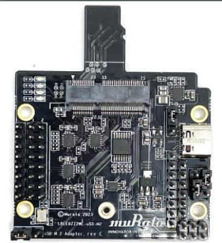
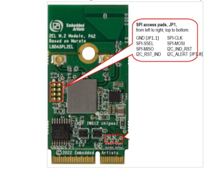
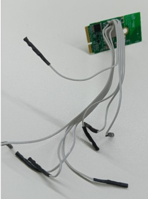
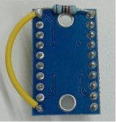
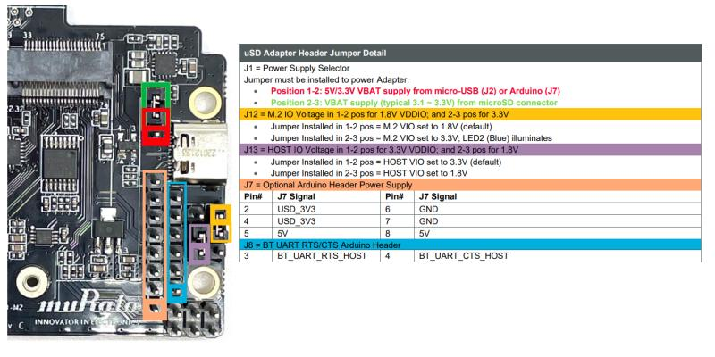
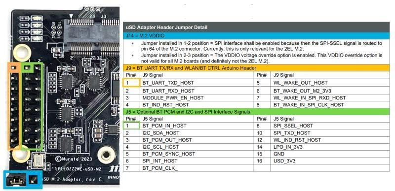
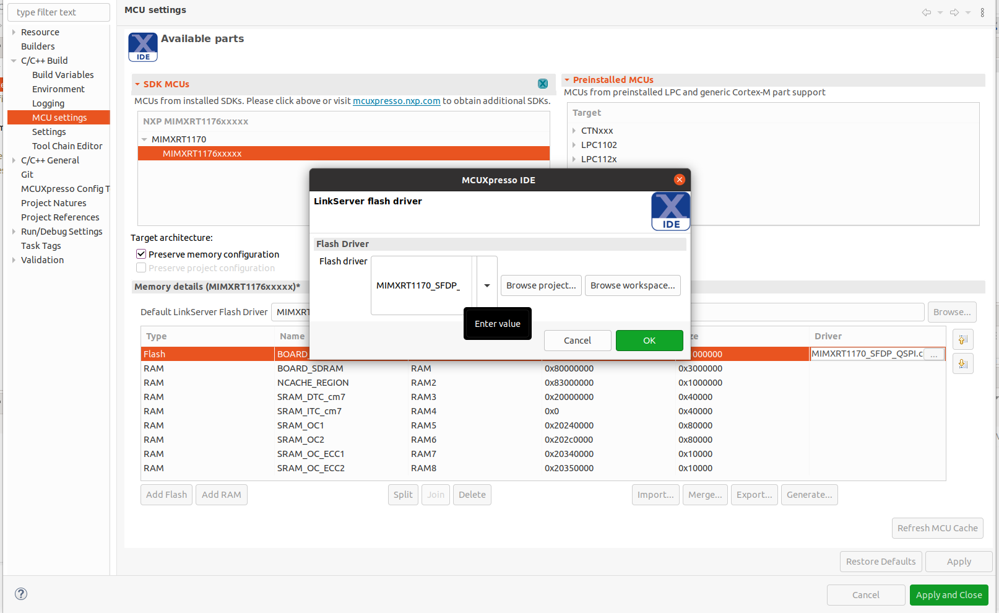

# CHIP RT1170 All-clusters Application

The all-clusters example implements a server which can be accesed by a CHIP controller and can accept basic cluster commands.

The example is based on
[Project CHIP](https://github.com/project-chip/connectedhomeip) and the NXP RT1170 SDK,
and provides a prototype application that demonstrates device commissioning and different cluster
control.


<hr>

- [CHIP RT1170 All-clusters Application](#chip-rt1170-all-clusters-application)
  - [Introduction](#introduction)
  - [Building](#building)
  - [Hardware requirements for RT1170 and IWX12](#hardware-requirements-for-rt1170-and-iwx12)
    - [Hardware rework for SPI support on EVKB-MIMXRT1170](#hardware-rework-for-spi-support-on-evkb-mimxrt1170)
    - [Hardware rework to connect SPI on 2EL M2 IW612 Module](#hardware-rework-to-connect-spi-on-2el-m2-iw612-module)
    - [Board settings (Spinel over SPI, BLE over UART)](#board-settings-spinel-over-spi-ble-over-uart)
  - [Manufacturing data](#manufacturing-data)
  - [Flashing and debugging](#flashing-and-debugging)
  - [Testing the example](#testing-the-example)
    - [Testing the all-clusters application without Matter CLI:](#testing-the-all-clusters-application-without-matter-cli)
    - [Testing with matter shell](#testing-with-matter-shell)

<hr>

<a name="introduction"></a>

## Introduction


The RT1170 all-cluster application provides a working demonstration of the
RT1170 board integration, built using the Project CHIP codebase and the NXP
RT1170 SDK. The example supports basic ZCL commands and acts as a thermostat device-type.

The example supports:

- Matter over openthread. For that follow instructions from [README_Openthread.md][README_Openthread.md].

[README_Openthread.md]: README_Openthread.md

- Matter over Wifi. For that follow instructions from [README_Wifi.md][README_Wifi.md].

[README_Wifi.md]: README_Wifi.md

The example targets the [NXP MIMXRT1170-EVKB](https://www.nxp.com/part/MIMXRT1170-EVKB#/) board by default.


<a name="building"></a>

## Building

In order to build the Project CHIP example, we recommend using a Linux
distribution (the demo-application was compiled on Ubuntu 20.04).

-   Follow instruction in [BUILDING.md](../../../../../docs/guides/BUILDING.md)
    to setup the environment to be able to build Matter.

-   Download [RT1170+IW61X SDK v2.13.3](https://mcuxpresso.nxp.com/en/select).
    Creating an nxp.com account is required before being able to download the
    SDK. Once the account is created, login and follow the steps for downloading
    SDK. The SDK Builder UI selection should be similar with the one from the
    image below. In case you do not have access to the SDK, please ask your NXP
    representative.


    (Note: All SDK components should be selected. If size is an issue Azure RTOS
    component can be omitted.)

-   Start building the application.

```
user@ubuntu:~/Desktop/git/connectedhomeip$ export NXP_SDK_ROOT=/path/to/previously/downloaded/SDK
user@ubuntu:~/Desktop/git/connectedhomeip$ source ./scripts/bootstrap.sh
user@ubuntu:~/Desktop/git/connectedhomeip$ scripts/checkout_submodules.py --shallow --platform nxp --recursive
user@ubuntu:~/Desktop/git/connectedhomeip$ source ./scripts/activate.sh
user@ubuntu:~/Desktop/git/connectedhomeip$ cd examples/all-cluster/nxp/rt/rt1170/
```

Optional GN options that can be added when building an application:

- To enable the [matter CLI](#testing-with-matter-shell), the argument ```chip_enable_matter_cli=true``` must be added to the *gn gen* command.
- To switch the SDK type used, the argument ```is_<sdk_type>=true``` must be added to the *gn gen* command (with <sdk_type> being either sdk_package or sdk_internal).
- To build the application in debug mode, the argument ```is_debug=true optimize_debug=false``` must be added to the *gn gen* command.
- To build with the option to have Matter certificates/keys pre-loaded in a specific flash area the argument ```chip_with_factory_data=1``` must be added to the *gn gen* command. (for more information see [Guide for writing manufacturing data on NXP devices](../../../../platform/nxp/doc/manufacturing_flow.md).
- To build the application with the OTA Requestor enabled, the arguments ```chip_enable_ota_requestor=true no_mcuboot=false``` must be added to the *gn gen* command. (More information about the OTA Requestor feature in [OTA Requestor README](README_OTA_Requestor.md)))

Refer to the Building section in wi-fi or openthread specific README file.


<a name="hardware-requirements-for-rt1170-and-iwx12"></a>

## Hardware requirements for RT1170 and IWX12

Host part:
- 1 EVKB-MIMXRT1170

Transceiver part :
- 1 [2EL M2 A1 IW612 Secure Module]( https://www.nxp.com/products/wireless/wi-fi-plus-bluetooth-plus-802-15-4/2-4-5-ghz-dual-band-1x1-wi-fi-6-802-11ax-plus-bluetooth-5-2-plus-802-15-4-tri-radio-solution:IW612)


- 1 [Murata uSD to M2 adapter](https://www.murata.com/en-eu/products/connectivitymodule/wi-fi-bluetooth/overview/lineup/usd-m2-adapter)


- TXS0108E level shifter module.


- Male to female Burg cables – 20 number’s 

### Hardware rework for SPI support on EVKB-MIMXRT1170

To support SPI on the EVKB-MIMXRT1170 board, it is required to remove 0Ω resistors R404,R406,R2015.

### Hardware rework to connect SPI on 2EL M2 IW612 Module

- Solder burg wires (male to female) at JP1 for SPI interface.




- Solder 2X10 Berg Pins to TXS0108E connector.
- Solder 10 K ohm resistor between OE and GND. 
- Connect OE and VA




### Board settings (Spinel over SPI, BLE over UART)

- Murata uSD to M2 adapter connections description:






- Jumpers should be as below:
  - J1 position 1-2 , use micro-USB for power supply
  - J12 position 1-2
  - J13 position 1-2


- SPI connection between RT1170 to TXS0108E level shifter

|  MIMXRT1170-EVKB  | TXS0108E |
| :---------------: | :------: |
| VDD_3V3 (J10_16)  |     VB   |
| SPI_MOSI (J10.8)  |     B1   |
| SPI_MISO (J10.10) |     B2   |
| SPI_CLK (J10.12)  |     B3   |
| SPI_CS (J10.6)    |     B4   |
| SPI_INT (J26.4)   |     B5   |
| GND (J10.14)      |    GND   |

- SPI line connection between IWX612 2EL M2 Module to TXS0108E level shifter

|  IWX612 2EL M2  | TXS0108E |
| :-------------: | :------: |
| 1.8V_REF(J13.3) |     VA   |
| SPI_MOSI (JP1.4)|     A1   |
| SPI_MISO (JP1.5)|     A2   |
| SPI_CLK (JP1.2) |     A3   |
| SPI_SSEL (JP1.3)|     A4   |
| SPI_INT (JP1.8) |     A5   |

- UART BLE and Reset connections between RT1170  and uSD-M2 adapter 

|  MIMXRT1170-EVKB  | Murata uSD-M2 |
| :---------------: | :-----------: |
| RESET (J26.2)     |      J9.3     |
| UART RXD (J25.13) |      J9.1     |
| UART TXD (J25.15) |      J9.2     |
| UART CTS (J25.9)  |      J8.4     |
| UART RTS (J25.11) |      J8.3     |
| GND (J26.1)       |      J7.6     |


The below tables explain pin settings (SPI settings) to connect the evkbmimxrt1170 (host) to a IWX12 transceiver (rcp).

J1 jumper on Murata uSD-M2 adpter should be in 1-2 position, board is powered using USB connection.

The murata uSD-M2 adapter should be plugged to the RT1170 via SDIO.

<a name="manufacturing-data"></a>

## Manufacturing data

See [Guide for writing manufacturing data on NXP devices](../../../../platform/nxp/doc/manufacturing_flow.md)

Other comments:

The all cluster app demonstrates the usage of encrypted Matter manufacturing data storage. Matter manufacturing data should be encrypted using an AES 128 software key before flashing them to the device flash.

<a name="flashing-and-debugging"></a>

## Flashing and debugging

In order to flash the application we recommend using
[MCUXpresso IDE (version >= 11.5.0)](https://www.nxp.com/design/software/development-software/mcuxpresso-software-and-tools-/mcuxpresso-integrated-development-environment-ide:MCUXpresso-IDE).

-   Import the previously downloaded NXP SDK into MCUXpresso IDE. This can be
    done by drag-and-dropping the SDK archive into MCUXpresso IDE's "Installed
    SDKs" tab; 
-   Import the connectedhomeip repo in MCUXpresso IDE as Makefile Project. Use _none_ as _Toolchain for Indexer Settings_:

```
File -> Import -> C/C++ -> Existing Code as Makefile Project
```

- Configure MCU Settings:

```
Right click on the Project -> Properties -> C/C++ Build -> MCU Settings -> Select MIMXRT1170 -> Apply & Close
```


Sometimes when the MCU is selected it will not initialize all the memory regions (usualy the BOARD_FLASH, BOARD_SDRAM 
and NCAHCE_REGION) so it is required that this regions are added manualy like in the image above. In addition to that 
on the BOARD_FLASH line, in the driver tab: 
```
click inside the tab and on the right side a button with three horizontal dots will appear 
click on the button and an window will show
form the dropdown menu select the MIMXRT1170_SFDP_QSPI driver
```



- Configure the toolchain editor:

```
Right click on the Project -> C/C++ Build-> Tool Chain Editor -> NXP MCU Tools -> Apply & Close
```


- Create a debug configuration:

  MIMXRT1170-EVKB board supports CMSIS-DAP debug protocol by default. It should be switched to JLink.
    - download and install [MCU-LINK_INSTALLER 2.263](https://www.nxp.com/webapp/Download?colCode=MCU-LINK_INSTALLER_2.263_LIN)
    - connect jumper JP3 to get board in ISP mode when powered
    - connect board and run installed MCU-LINK, follow steps to flash JLINK firmware
    - remove jumper JP3 and reboot board 

```
Right click on the Project -> Debug -> As->SEGGER J-Link probes -> OK -> Select elf file
```


- Set the _Initialization Commands_ to:

```
Right click on the Project -> Debug As -> Debug configurations... -> Startup

set non-stop on
set pagination off
set mi-async
set remotetimeout 60000
##target_extended_remote##
set mem inaccessible-by-default ${mem.access}
mon ondisconnect ${ondisconnect}
set arm force-mode thumb
${load}
```


- Set the _vector.catch_ value to _false_ inside the .launch file:

```
Right click on the Project -> Utilities -> Open Directory Browser here -> edit *.launch file:

<booleanAttribute key="vector.catch" value="false"/>

```

- Debug using the newly created configuration file:

<a name="testing-the-example"></a>

## Testing the example

To know how to commision a device over BLE, follow the instructions from [chip-tool's README.md 'Commission a device over BLE'][readme_ble_commissioning_section].

[readme_ble_commissioning_section]:../../../../chip-tool/README.md#commission-a-device-over-ble

To know how to commissioning a device over IP, follow the instructions from [chip-tool's README.md 'Pair a device over IP'][readme_pair_ip_commissioning_section]

[readme_pair_ip_commissioning_section]: ../../../../chip-tool/README.md#pair-a-device-over-ip

### Testing the all-clusters application without Matter CLI:

1. Prepare the board with the flashed `All-cluster application` (as shown above).
2. The All-cluster example uses UART1 to print logs while running the server. To view raw UART output, start a terminal emulator like PuTTY and connect to the used COM port with the following UART settings:

   - Baud rate: 115200
   - 8 data bits
   - 1 stop bit
   - No parity
   - No flow control

3. Open a terminal connection on the board and watch the printed logs.

4. On the client side, start sending commands using the [chip-tool](../../../../../examples/chip-tool)  application as it is described [here](../../../../../examples/chip-tool/README.md#using-the-client-to-send-matter-commands).


<a name="testing-with-matter-shell"></a>

### Testing with matter shell

Testing the all-clusters application with Matter CLI enabled:

The Matter CLI can be enabled with the all-clusters application.

For more information about the Matter CLI default commands, you can refer to the dedicated [ReadMe](../../../../shell/README.md).

The All-clusters application supports additional commands :
```
> help
[...]
mattercommissioning     Open/close the commissioning window. Usage : mattercommissioning [on|off]
matterfactoryreset      Perform a factory reset on the device
matterreset             Reset the device
```
- ```matterfactoryreset``` command erases the file system completely (all Matter settings are erased).
- ```matterreset``` enables the device to reboot without erasing the settings.

Here are described steps to use the all-cluster-app with the Matter CLI enabled

1. Prepare the board with the flashed `All-cluster application` (as shown above).
2. The matter CLI is accessible in UART1. For that, start a terminal emulator like PuTTY and connect to the used COM port with the following UART settings:

   - Baud rate: 115200
   - 8 data bits
   - 1 stop bit
   - No parity
   - No flow control

3. The All-cluster example uses UART2 to print logs while running the server. To view raw UART output, a pin should be plugged to an USB to UART adapter (connector J9 pin 4), then start a terminal emulator like PuTTY and connect to the used COM port with the following UART settings:

   - Baud rate: 115200
   - 8 data bits
   - 1 stop bit
   - No parity
   - No flow control

4. On the client side, start sending commands using the [chip-tool](../../../../../examples/chip-tool/README.md)  application as it is described [here](../../../../../examples/chip-tool/README.md#using-the-client-to-send-matter-commands).