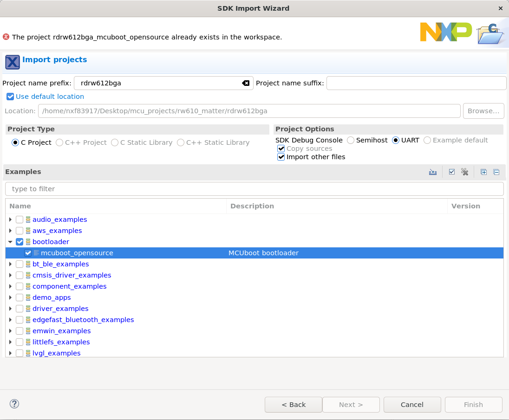
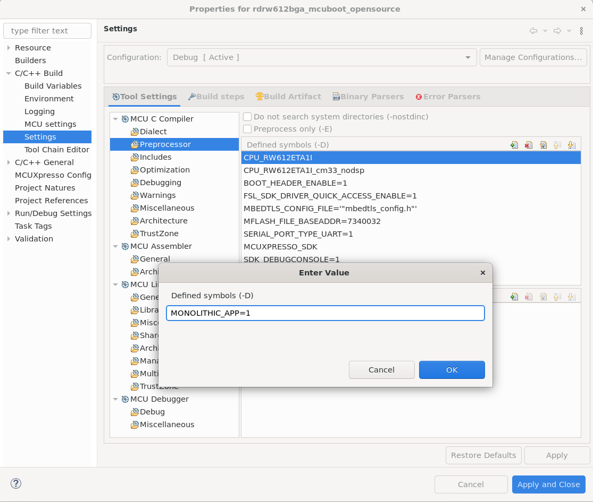

# OTA requestor feature

## Overview
The OTA Requestor feature enables the device to be informed of, download and apply a software update from an OTA Provider.

This section explains how to perform an OTA Software Update using the RW612 All-Clusters application.

In general, the Over-The-Air Software Update process consists of the following steps :
- The OTA Requestor queries an update image from the OTA Provider which responds according to its availability.
- The update image is received in blocks and stored in the external flash of the device.
- Once the update image is fully downloaded, the bootloader is notified and the device resets applying the update in test-mode.
- If the test is successful, the update is applied permanently. Otherwise, the bootloader reverts back to the primary application, preventing any downgrade. 

### Flash Memory Layout

The RW612 Flash is divided into different regions as follow :
- Bootloader : MCUBoot resides at the base of the flash and occupies 0x20000 (128 kBytes).
- Primary application partition : The all-clusters application which would be run by the bootloader (active application). The size reserved for this partition is 4.4 MBytes.
- Secondary application partition : Update image received with the OTA (candidate application). The size reserved for the partition is 4.4 MBytes.

Notes : 
- The CPU1/CPU2 firmwares are embedded in the CPU3 all-clusters application.
- The sizes of the primary and secondary applications are provided as an example (currently 4.4 MB is reserved for each partition). The size can be changed by modifying the `m_app_max_sectors` value in the linkerscript of the application (RW610_flash.ld).

### MCUBoot Bootloader

MCUBoot is an open-source secure bootloader used by RW612 to apply the self-upgrade. For more details, please refer to the [MCUBoot documentation](https://github.com/mcu-tools/mcuboot/blob/main/docs/design.md).

In our use case, the bootloader runs the application residing in the primary partition. In order to run the OTA update image, the bootloader will swap the content of the primary and the secondary partitions. This type of upgrade is called swap-move and is the default upgrade configured by MCUBoot.

## OTA Software Update process for RW612 all-clusters application

### Flashing the bootloader

In order for the device to perform the software update, the MCUBoot bootloader must be flashed first at the base of the flash. A step-by-step guide is given below.

- It is recommended to start with erasing the external flash of the device, for this JLink from Segger can be used. It can be downloaded and installed from https://www.segger.com/products/debug-probes/j-link. Once installed, JLink can be run using the command line :
```
$ JLink
```
Run the following commands :
```
J-Link > connect
Device> ? # you will be presented with a dialog -> select `RW612`
Please specify target interface:
J) JTAG (Default)
S) SWD
T) cJTAG
TIF> S
Specify target interface speed [kHz]. <Default>: 4000 kHz
Speed> # <enter>
J-Link > exec EnableEraseAllFlashBanks
J-Link > erase 0x8000000, 0x88a0000
```
- Using MCUXPresso, import the `mcuboot_opensource` demo example from the SDK previously downloaded.

- Before building the demo example, it should be specified that the application to be run by the bootloader is monolithic. As a result, only one upgradable image will be considered by the bootloader. This can be done by defining `MONOLITHIC_APP` as 1 in the settings of the mcuboot_opensource project :
```
Right click on the Project -> Properties -> C/C++ Build -> Settings -> Tool Settings -> MCU C Compiler -> Preprocessor -> Add "MONOLITHIC_APP=1" in the Defined Symbols
```

- Build the demo example project and program it to the target board.
- To run the flashed demo, either press the reset button of the device or use the debugger IDE of MCUXpresso. If it runs successfully, the following logs will be displayed on the terminal :

```
hello sbl.
Bootloader Version 1.9.0
Primary image: magic=unset, swap_type=0x1, copy_done=0x3, image_ok=0x3
Secondary image: magic=unset, swap_type=0x1, copy_done=0x3, image_ok=0x3
Boot source: none
Swap type: none
erasing trailer; fa_id=2
Unable to find bootable image
```

Note : By default, mcuboot application considers the primary and secondary partitions to be the size of 4.4 MB. If the size is to be changed, the partition addresses should be modified in the flash_partitioning.h accordingly. For more information about the flash partitioning with mcuboot, please refer to the dedicated readme.txt located in "SDK_RW612/boards/rdrw612bga/ota_examples/mcuboot_opensource/".

### Generating and flashing the signed application image

After flashing the bootloader, the application can be programmed to the board. The image must have the following format :
- Header : contains general information about the image (version, size, magic...)
- Code of the application : generated binary 
- Trailer : contains metadata needed by the bootloader such as the image signature, the upgrade type, the swap status...

The application can be generated using the instructions from the [README.md 'Building section'][readme_building_section] section. The application is automatically linked to be executed from the primary image partition, taking into consideration the offset imposed by mcuboot.

[readme_building_section]: README.md#building

The resulting executable file found in out/debug/chip-rw610-all-cluster-example needs to be converted into raw binary format as shown below.
```
arm-none-eabi-objcopy -R .flash_config -R .NVM -O binary chip-rw610-all-cluster-example chip-rw610-all-cluster-example.bin
```
To sign the image and wrap the raw binary of the application with the header and trailer, "imgtool" is provided in the SDK and can be found in "/middleware/mcuboot_opensource/scripts/".

The following commands can be run (make sure to replace the /path/to/file/binary with the adequate files): 

```
user@ubuntu: cd ~/Desktop/SDK_RW612/middleware/mcuboot_opensource/scripts

user@ubuntu: python3 imgtool.py sign --key ~/Desktop/SDK_RW612/boards/rdrw612bga/ota_examples/mcuboot_opensource/keys/sign-rsa2048-priv.pem --align 4 --header-size 0x1000 --pad-header --slot-size 0x440000 --max-sectors 1088 --version "1.0" ~/Desktop/connectedhomeip/examples/all-clusters-app/nxp/rt/rw610/out/debug/chip-rw610-all-cluster-example.bin ~/Desktop/connectedhomeip/examples/all-clusters-app/nxp/rt/rw610/out/debug/chip-rw610-all-cluster-example_SIGNED.bin
```
Notes : 
- If internal SDK is used instead, the key can be found in : "~/Desktop/SDK_RW612/middleware/mcuboot_opensource/boot/nxp_mcux_sdk/keys/sign-rsa2048-priv.pem".
- The arguments `slot-size` and `max-sectors` should be adjusted to the size of the partitions reserved for the primary and the secondary applications. (By default the size considered is 4.4 MB)
- In this example, the image is signed with the private key provided by the SDK as an example (/path_to_sdk/middleware/mcuboot_opensource/boot/nxp_mcux_sdk/keys/sign-rsa2048-priv.pem), MCUBoot is built with its corresponding public key which would be used to verify the integrity of the image. It is possible to generate a new pair of keys using the following commands. This procedure should be done prior to building the mcuboot application.

- To generate the private key :

```
user@ubuntu: python3 imgtool.py keygen -k priv_key.pem -t rsa-2048
```
- To extract the public key :

```
user@ubuntu: python3 imgtool.py getpub -k priv_key.pem
```
- The extracted public key can then be copied to the /path_to_sdk/middleware/mcuboot_opensource/boot/nxp_mcux_sdk/keys/sign-rsa2048-pub.c, given as a value to the rsa_pub_key[] array.


The resulting output is the signed binary of the application version "1.0". 

JLink can be used to flash the application at the address 0x8020000, using the command :
```
J-Link > loadbin chip-rw610-all-cluster-example_SIGNED.bin 0x8020000
```

The bootloader should then be able to jump directly to the start of the application and run it.

### Generating the OTA Update Image

To generate the OTA update image the same procedure can be followed from the [Generating and flashing the signed application image](#generating-and-flashing-the-signed-application-image) sub-section, replacing the "--version "1.0"" argument with "--version "2.0"" (recent version of the update).

When the signed binary of the update is generated, the file should be converted into OTA format. To do so, the ota_image_tool is provided in the repo and can be used to convert a binary file into an .ota file. 

```
user@ubuntu:~/connectedhomeip$ : ./src/app/ota_image_tool.py create -v 0xDEAD -p 0xBEEF -vn 2 -vs "2.0" -da sha256 chip-rw610-all-cluster-example_SIGNED.bin chip-rw610-all-cluster-example.ota
```
The generated OTA file can be used to perform the OTA Software Update. The instructions below describe the procedure step-by-step.

### Performing the OTA Software Update

Setup example : 
- [Chip-tool](../../../../../examples/chip-tool/README.md) application running on the RPi. 
- OTA Provider application built on the same RPi (as explained below).
- RW612 board programmed with the All-clusters application (with the instructions above).

Before starting the OTA process, the Linux OTA Provider application can be built on the RPi (if not already present in the pre-installed apps) :
```
user@ubuntu:~/connectedhomeip$ : ./scripts/examples/gn_build_example.sh examples/ota-provider-app/linux out/ota-provider-app chip_config_network_layer_ble=false

user@ubuntu:~/connectedhomeip$ : rm -rf /tmp/chip_*
user@ubuntu:~/connectedhomeip$ : ./out/ota-provider-app/chip-ota-provider-app -f chip-rw610-all-cluster-example.ota
```
The OTA Provider should first be provisionned with chip-tool by assigning it the node id 1, and then granted the ACL entries :
```
user@ubuntu:~/connectedhomeip$ : ./out/chip-tool-app/chip-tool pairing onnetwork 1 20202021
user@ubuntu:~/connectedhomeip$ : ./out/chip-tool-app/chip-tool accesscontrol write acl '[{"fabricIndex": 1, "privilege": 5, "authMode": 2, "subjects": [112233], "targets": null}, {"fabricIndex": 1, "privilege": 3, "authMode": 2, "subjects": null, "targets": null}]' 1 0
```
The second step is to provision the device with the node id 2 using ble-wifi or ble-thread commissioning. For example :
```
user@ubuntu:~/connectedhomeip$ : ./out/chip-tool-app/chip-tool pairing ble-wifi 2 WIFI_SSID WIFI_PASSWORD 20202021 3840
```


Once commissioned, the OTA process can be initiated with the "announce-ota-provider" command using chip-tool (the given numbers refer respectively to [ProviderNodeId] [VendorId] [AnnouncementReason] [Endpoint] [node-id] [endpoint-id]) :
```
user@ubuntu:~/connectedhomeip$ : ./out/chip-tool-app/chip-tool otasoftwareupdaterequestor announce-otaprovider 1 0 0 0 2 0
```

When the full update image is downloaded and stored, the bootloader will be notified and the device will reboot with the update image.