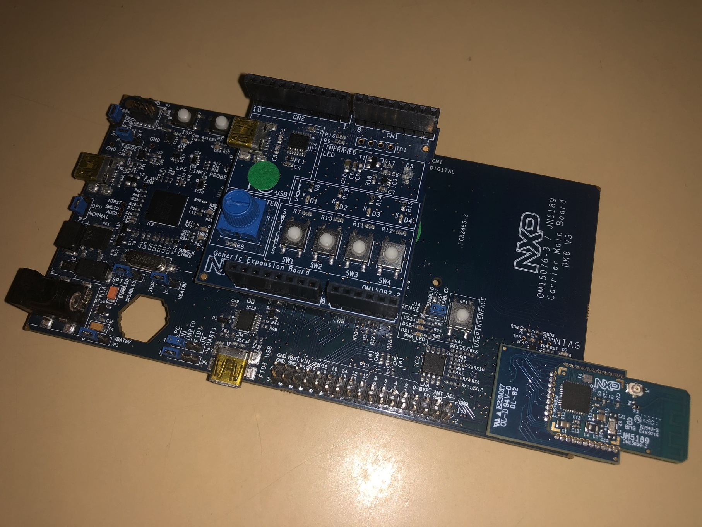
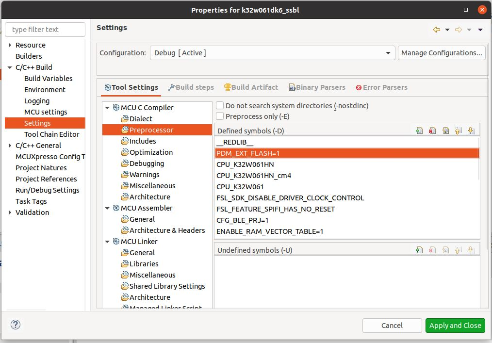
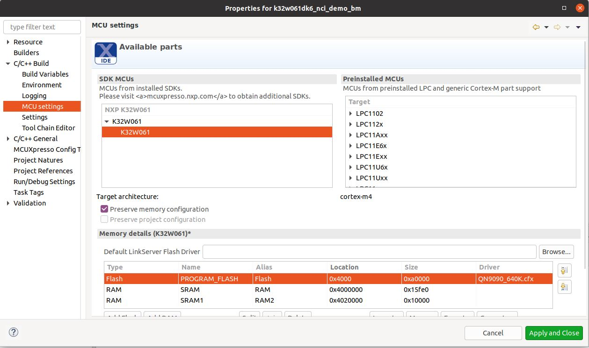
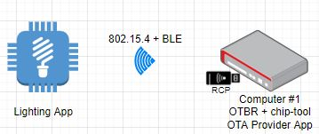
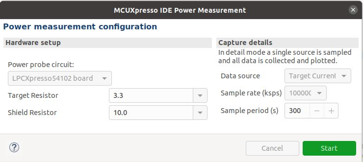

# CHIP K32W061 Contact Sensor Example Application

The Project CHIP K32W061 Contact Sensor Example uses buttons to test changing
the lock and device states and LEDs to show the state of these changes. You can
use this example as a reference for creating your own application.

The example is based on
[Project CHIP](https://github.com/project-chip/connectedhomeip) and the NXP K32W
SDK, and a simulated contact sensor over a low-power, 802.15.4 Thread network.

The example behaves as a Project CHIP accessory, that is a device that can be
paired into an existing Project CHIP network and can be controlled by this
network.

<hr>

-   [CHIP K32W0 Contact Sensor Example Application](#chip-k32w-contact-example-application) -
-   [Introduction](#introduction)
    -   [Bluetooth LE Advertising](#bluetooth-le-advertising)
    -   [Bluetooth LE Rendezvous](#bluetooth-le-rendezvous)
-   [Device UI](#device-ui)
-   [Building](#building)
    -   [Known issues](#building-issues)
-   [Manufacturing data](#manufacturing)
-   [Flashing and debugging](#flashdebug)
-   [Pigweed Tokenizer](#tokenizer)
    -   [Detokenizer script](#detokenizer)
    -   [Notes](#detokenizer-notes)
    -   [Known issues](#detokenizer-known-issues)
-   [NXP Ultrafast P256 ECC Library](#nxp-ultrafast-p256)
    -   [Building steps](#nxp-ultrafast-p256-building-steps)
-   [Tinycrypt ECC library](#tinycrypt)
    -   [Building steps](#tinycrypt-building-steps)
-   [OTA](#ota)
    -   [Writing the SSBL](#ssbl)
    -   [Writing the PSECT](#psect)
    -   [Writing the application](#appwrite)
    -   [OTA Testing](#otatesting)
    -   [Known issues](#otaissues)
-   [Low power](#low-power)

    -   [Known issues](#low-power-issues)
-   [Removing SSBL Upgrade region](#removing-ssbl-upgrade-region)

    </hr>

<a name="intro"></a>

## Introduction



The K32W061 contact sensor example application provides a working demonstration
of a connected contact sensor device, built using the Project CHIP codebase and
the NXP K32W061 SDK. The example supports remote access (e.g.: using CHIP Tool
from a mobile phone) and control of a simulated contact sensor over a low-power,
802.15.4 Thread network. It is capable of being paired into an existing Project
CHIP network along with other Project CHIP-enabled devices.

The example targets the
[NXP K32W061 DK6](https://www.nxp.com/products/wireless/thread/k32w061-41-high-performance-secure-and-ultra-low-power-mcu-for-zigbeethread-and-bluetooth-le-5-0-with-built-in-nfc-option:K32W061_41)
development kit, but is readily adaptable to other K32W-based hardware.

The CHIP device that runs the contact sensor application is controlled by the
CHIP controller device over the Thread protocol. By default, the CHIP device has
Thread disabled, and it should be paired over Bluetooth LE with the CHIP
controller and obtain configuration from it. The actions required before
establishing full communication are described below.

The example also comes with a test mode, which allows to start Thread with the
default settings by pressing a button. However, this mode does not guarantee
that the device will be able to communicate with the CHIP controller and other
devices.

### SE051H Secure Element

Deployment of this firmware configuration requires the K32W061 board setups
using the K32W061 module board, SE051 Expansion board and Generic Expansion
board as shown below:


The SE051H Secure Element extension may be used for best in class security and
offloading some of the Project CHIP cryptographic operations. Depending on your
hardware configuration, choose one of the options below (building with or
without Secure Element). NOTE: the SE051H is a derivative of the SE051 product
family (see http://www.nxp.com/SE051) including dedicated CHIP support in
addition to the SE051 feature set. See the material provided separately by NXP
for more details on SE051H.

### Bluetooth LE Advertising

In this example, to commission the device onto a Project CHIP network, it must
be discoverable over Bluetooth LE. For security reasons, you must start
Bluetooth LE advertising manually after powering up the device by pressing
Button USERINTERFACE.

### Bluetooth LE Rendezvous

In this example, the commissioning procedure (called rendezvous) is done over
Bluetooth LE between a CHIP device and the CHIP controller, where the controller
has the commissioner role.

To start the rendezvous, the controller must get the commissioning information
from the CHIP device. The data payload is encoded within a QR code, printed to
the UART console and shared using an NFC tag. For security reasons, you must
start NFC tag emulation manually after powering up the device by pressing
Button 4.

### Thread Provisioning

Last part of the rendezvous procedure, the provisioning operation involves
sending the Thread network credentials from the CHIP controller to the CHIP
device. As a result, device is able to join the Thread network and communicate
with other Thread devices in the network.

## Device UI

The example application provides a simple UI that depicts the state of the
device and offers basic user control. This UI is implemented via the
general-purpose LEDs and buttons built in to the OM15082 Expansion board
attached to the DK6 board.

**LED D2** shows the overall state of the device and its connectivity. Four
states are depicted:

-   _Short Flash On (50ms on/950ms off)_ &mdash; The device is in an
    unprovisioned (unpaired) state and is waiting for a commissioning
    application to connect.

*   _Rapid Even Flashing (100ms on/100ms off)_ &mdash; The device is in an
    unprovisioned state and a commissioning application is connected via BLE.

-   _Short Flash Off (950ms on/50ms off)_ &mdash; The device is full
    provisioned, but does not yet have full network (Thread) or service
    connectivity.

*   _Solid On_ &mdash; The device is fully provisioned and has full network and
    service connectivity.

**LED D3** shows the state of the simulated lock bolt. When the LED is lit the
bolt is extended (i.e. door locked); when not lit, the bolt is retracted (door
unlocked). The LED will flash whenever the simulated bolt is in motion from one
position to another.

**Button SW2** can be used to reset the device to a default state. A short Press
Button SW2 initiates a factory reset. After an initial period of 3 seconds, LED2
D2 and D3 will flash in unison to signal the pending reset. After 6 seconds will
cause the device to reset its persistent configuration and initiate a reboot.
The reset action can be cancelled by press SW2 button at any point before the 6
second limit.

**Button SW3** can be used to change the state of the simulated bolt. This can
be used to mimic a user manually operating the lock. The button behaves as a
toggle, swapping the state every time it is pressed.

**Button SW4** can be used for joining a predefined Thread network advertised by
a Border Router. Default parameters for a Thread network are hard-coded and are
being used if this button is pressed.

The remaining two LEDs (D1/D4) and button (SW1) are unused.

Directly on the development board, **Button USERINTERFACE** can be used for
enabling Bluetooth LE advertising for a predefined period of time. Also, pushing
this button starts the NFC emulation by writing the onboarding information in
the NTAG.

### No expansion board

In case the **OM15082** Expansion board is not attached to the DK6 board, the
functionality of LED D2 and LED D3 is taken over by LED DS2, respectively LED
DS3, which can be found on the DK6 board.

Also, by long pressing the **USERINTERFACE** button, the factory reset action
will be initiated.

When low power is enabled, the **ISP button** on DK6 board is used to change contact status.
<a name="building"></a>

## Building

In order to build the Project CHIP example, we recommend using a Linux
distribution (the demo-application was compiled on Ubuntu 20.04).

-   Download
    [K32W061DK6 SDK 2.6.10](https://cache.nxp.com/lgfiles/bsps/SDK_2_6_10_K32W061DK6.zip).

-   Start building the application either with Secure Element or without

    -   without Secure Element

    ```
    user@ubuntu:~/Desktop/git/connectedhomeip$ export NXP_K32W0_SDK_ROOT=/home/user/Desktop/SDK_2_6_10_K32W061DK6/
    user@ubuntu:~/Desktop/git/connectedhomeip$ ./third_party/nxp/k32w0_sdk/sdk_fixes/patch_k32w_sdk.sh
    user@ubuntu:~/Desktop/git/connectedhomeip$ source ./scripts/activate.sh
    user@ubuntu:~/Desktop/git/connectedhomeip$ cd examples/contact-sensor-app/nxp/k32w/k32w0
    user@ubuntu:~/Desktop/git/connectedhomeip/examples/contact-sensor-app/nxp/k32w/k32w0$ gn gen out/debug --args="k32w0_sdk_root=\"${NXP_K32W0_SDK_ROOT}\" chip_with_OM15082=1 chip_with_ot_cli=0 is_debug=false chip_crypto=\"platform\" chip_with_se05x=0 chip_pw_tokenizer_logging=true"
    user@ubuntu:~/Desktop/git/connectedhomeip/examples/contact-sensor-app/nxp/k32w/k32w0$ ninja -C out/debug
    user@ubuntu:~/Desktop/git/connectedhomeip/examples/contact-sensor-app/nxp/k32w/k32w0$ $NXP_K32W0_SDK_ROOT/tools/imagetool/sign_images.sh out/debug/
    ```

    -   with Secure element Exactly the same steps as above but set
        chip_with_se05x=1 in the gn command and add argument
        chip_enable_ota_requestor=false

Note that option chip_enable_ota_requestor=false are required for building with
Secure Element. These can be changed if building without Secure Element

- K32W041AM flavor

    Exactly the same steps as above but set argument build_for_k32w041am=1 in the gn command and use [K32W041AMDK6 SDK 2.6.10](https://cache.nxp.com/lgfiles/bsps/SDK_2_6_10_K32W041AMDK6.zip).

Also, in case the OM15082 Expansion Board is not attached to the DK6 board, the
build argument (chip_with_OM15082) inside the gn build instruction should be set
to zero. The argument chip_with_OM15082 is set to zero by default.

In case that Openthread CLI is needed, chip_with_ot_cli build argument must be
set to 1.

In case the board doesn't have 32KHz crystal fitted, one can use the 32KHz free
running oscilator as a clock source. In this case one must set the use_fro_32k
argument to 1.

In case signing errors are encountered when running the "sign_images.sh" script
install the recommanded packages (python version > 3, pip3, pycrypto,
pycryptodome):

```
user@ubuntu:~$ python3 --version
Python 3.8.2
user@ubuntu:~$ pip3 --version
pip 20.0.2 from /usr/lib/python3/dist-packages/pip (python 3.8)
user@ubuntu:~$ pip3 list | grep -i pycrypto
pycrypto               2.6.1
pycryptodome           3.9.8
```

The resulting output file can be found in out/debug/chip-k32w0x-contact-example.

<a name="building-issues"></a>

## Known issues

-   When using Secure element and cross-compiling on Linux, log messages from
    the Plug&Trust middleware stack may not echo to the console.

<a name="manufacturing"></a>

## Manufacturing data

See
[Guide for writing manufacturing data on NXP devices](../../../../platform/nxp/doc/manufacturing_flow.md).

There are factory data generated binaries available in examples/platform/nxp/k32w/k32w0/scripts/demo_generated_factory_data folder.
These are based on the DAC, PAI and PAA certificates found in scripts/tools/nxp/demo_generated_certs folder.
The demo_factory_data_dut1.bin uses the DAC certificate and private key found in examples/platform/nxp/k32w/k32w0/scripts/demo_generated_factory_data/dac/dut1 folder.
The demo_factory_data_dut2.bin uses the DAC certificate and private key found in examples/platform/nxp/k32w/k32w0/scripts/demo_generated_factory_data/dac/dut2 folder.
These two factory data binaries can be used for testing topologies with 2 DUTS. They contain the corresponding DACs/PAIs generated using generate_nxp_chip_factory_bin.py script.
The discriminator is 14014 and the passcode is 1000.
These demo certificates are working with the CDs installed in CHIPProjectConfig.h.

Regarding factory data provider, there are two options:
* use the default factory data provider: `K32W0FactoryDataProvider` by setting `chip_with_factory_data=1` in the gn build command.
* use a custom factory data provider: please see
[Guide for implementing a custom factory data provider](../../../../platform/nxp/k32w/k32w0/common/README.md). This can be enabled when `chip_with_factory_data=1` by setting `use_custom_factory_provider=1` in the gn build command.

<a name="flashdebug"></a>

## Flashing and debugging

Program the firmware using the official
[OpenThread Flash Instructions](https://github.com/openthread/ot-nxp/tree/main/src/k32w0/k32w061#flash-binaries).

All you have to do is to replace the Openthread binaries from the above
documentation with _out/debug/chip-k32w0x-contact-example.bin_ if DK6Programmer is
used or with _out/debug/chip-k32w0x-contact-example_ if MCUXpresso is used.

<a name="tokenizer"></a>

## Pigweed tokenizer

The tokenizer is a pigweed module that allows hashing the strings. This greatly
reduces the flash needed for logs. The module can be enabled by building with
the gn argument _chip_pw_tokenizer_logging=true_. The detokenizer script is
needed for parsing the hashed scripts.

<a name="detokenizer"></a>

### Detokenizer script

The python3 script detokenizer.py is a script that decodes the tokenized logs
either from a file or from a serial port. It is located in the following path
`examples/platform/nxp/k32w/k32w0/scripts/detokenizer.py`.

The script can be used in the following ways:

```
usage: detokenizer.py serial [-h] -i INPUT -d DATABASE [-o OUTPUT]
usage: detokenizer.py file [-h] -i INPUT -d DATABASE -o OUTPUT
```

The first parameter is either _serial_ or _file_ and it selects between decoding
from a file or from a serial port.

The second parameter is _-i INPUT_ and it must se set to the path of the file or
the serial to decode from.

The third parameter is _-d DATABASE_ and represents the path to the token
database to be used for decoding. The default path is
_out/debug/chip-k32w0x-contact-example-database.bin_ after a successful build.

The forth parameter is _-o OUTPUT_ and it represents the path to the output file
where the decoded logs will be stored. This parameter is required for file usage
and optional for serial usage. If not provided when used with serial port, it
will show the decoded log only at the stdout and not save it to file.

<a name="detokenizer-notes"></a>

### Notes

The token database is created automatically after building the binary if the
argument _chip_pw_tokenizer_logging=true_ was used.

The detokenizer script must be run inside the example's folder after a
successful run of the _scripts/activate.sh_ script. The pw_tokenizer module used
by the script is loaded by the environment. An example of running the
detokenizer script to see logs of a contact-sensor app:

```
python3 ../../../../../examples/platform/nxp/k32w/k32w0/scripts/detokenizer.py serial -i /dev/ttyACM0 -d out/debug/chip-k32w0x-contact-example-database.bin -o device.txt
```

<a name="detokenizer-known-issues"></a>

### Known issues

The building process will not update the token database if it already exists. In
case that new strings are added and the database already exists in the output
folder, it must be deleted so that it will be recreated at the next build.

Not all tokens will be decoded. This is due to a gcc/pw_tokenizer issue. The
pw_tokenizer creates special elf sections using attributes where the tokens and
strings will be stored. This sections will be used by the database creation
script. For template C++ functions, gcc ignores these attributes and places all
the strings by default in the .rodata section. As a result the database creation
script won't find them in the special-created sections.

If run, closed and rerun with the serial option on the same serial port, the
detokenization script will get stuck and not show any logs. The solution is to
unplug and plug the board and then rerun the script.

<a name="nxp-ultrafast-p256"></a>

## NXP Ultrafast P256 ECC Library

<a name="nxp-ultrafast-p256-building-steps"></a>

### Building steps

By default, the application builds with NXP Ultrafast P256 ECC Library.
To build with this library, use the following arguments:

-   Build without Secure element (_chip_with_se05x=0_) and with crypto platform
    (_chip_crypto=\"platform\"_).

To stop using  Ultrafast P256 ECC Library, simply build with _chip_crypto=\"mbedtls\"_
or with Tinycrypt.

<a name="tinycrypt"></a>

## Tinycrypt ECC library

<a name="tinycrypt-building-steps"></a>

### Building steps

In order to use the Tinycrypt ECC library, use the following build arguments:

-   Build without Secure element (_chip_with_se05x=0_), with crypto platform
    (_chip_crypto=\"platform\"_) and with tinycrypt selected
    (_chip_crypto_flavour=\"tinycrypt\"_).

<a name="ota"></a>

## OTA

The internal flash needs to be prepared for the OTA process. First 16K of the
internal flash needs to be populated with a Secondary Stage Bootloader (SSBL)
related data while the last 8.5K of flash space is holding image directory
related data (PSECT). The space between these two zones will be filled by the
application.

<a name="ssbl"></a>

### Writing the SSBL

The SSBL can ge generated from one of the SDK demo examples. The SDK demo
example needs to be compiled inside MCUXpresso with the define _PDM_EXT_FLASH_.
The SSBL demo application can be imported from the _Quickstart panel_: _Import
SDK example(s)_ -> select _wireless->framework->ssbl_ application.


The SSBL project must be compiled using the PDM_EXT_FLASH define.



Once compiled, the required ssbl file is called k32w061dk6_ssbl.bin


Before writing the SSBL, it it recommanded to fully erase the internal flash:

```
DK6Programmer.exe -V 5 -P 1000000 -s <COM_PORT> -e Flash
```

k32w061dk6_ssbl.bin must be written at address 0 in the internal flash:

```
DK6Programmer.exe -V2 -s <COM_PORT> -P 1000000 -Y -p FLASH@0x00="k32w061dk6_ssbl.bin"
```

<a name="psect"></a>

### Writing the PSECT

First, image directory 0 must be written:

```
DK6Programmer.exe -V5 -s <COM port> -P 1000000 -w image_dir_0=0000000010000000
```

Here is the interpretation of the fields:

```
00000000 -> start address 0x00000000
1000     -> size = 0x0010 pages of 512-bytes (= 8kB)
00       -> not bootable (only used by the SSBL to support SSBL update)
00       -> SSBL Image Type
```

Second, image directory 1 must be written:

```
DK6Programmer.exe -V5 -s <COM port> -P 1000000 -w image_dir_1=00400000C9040101
```

Here is the interpretation of the fields:

```
00400000 -> start address 0x00004000
CD04     -> 0x4C9 pages of 512-bytes (= 612,5kB)
01       -> bootable flag
01       -> image type for the application
```

<a name="appwrite"></a>

### Writing the application

DK6Programmer can be used for flashing the application:

```
DK6Programmer.exe -V2 -s <COM_PORT> -P 1000000 -Y -p FLASH@0x4000="chip-k32w0x-contact-example.bin"
```

If debugging is needed, MCUXpresso can be used then for flashing the
application. Please make sure that the application is written at address 0x4000:



<a name="otatesting"></a>

### OTA Testing

The OTA topology used for OTA testing is illustrated in the figure below.
Topology is similar with the one used for Matter Test Events.



The concept for OTA is the next one:

-   there is an OTA Provider Application that holds the OTA image. In our case,
    this is a Linux application running on an Ubuntu based-system;
-   the OTA Requestor functionality is embedded inside the Lighting Application.
    It will be used for requesting OTA blocks from the OTA Provider;
-   the controller (a linux application called chip-tool) will be used for
    commissioning both the device and the OTA Provider App. The device will be
    commissioned using the standard Matter flow (BLE + IEEE 802.15.4) while the
    OTA Provider Application will be commissioned using the _onnetwork_ option
    of chip-tool;
-   during commissioning, each device is assigned a node id by the chip-tool
    (can be specified manually by the user). Using the node id of the device and
    of the lighting application, chip-tool triggers the OTA transfer by invoking
    the _announce-ota-provider_ command - basically, the OTA Requestor is
    informed of the node id of the OTA Provider Application.

_Computer #1_ can be any system running an Ubuntu distribution. We recommand
using TE 7.5 instructions from
[here](https://groups.csa-iot.org/wg/matter-csg/document/24839), where RPi 4 are
proposed. Also, TE 7.5 instructions document point to the OS/Docker images that
should be used on the RPis. For compatibility reasons, we recommand compiling
chip-tool and OTA Provider applications with the same commit id that was used
for compiling the Lighting Application. Also, please note that there is a single
controller (chip-tool) running on Computer #1 which is used for commissioning
both the device and the OTA Provider Application. If needed,
[these instructions](https://itsfoss.com/connect-wifi-terminal-ubuntu/) could be
used for connecting the RPis to WiFi.

Build the Linux OTA provider application:

```
user@computer1:~/connectedhomeip$ : ./scripts/examples/gn_build_example.sh examples/ota-provider-app/linux out/ota-provider-app chip_config_network_layer_ble=false
```

Build Linux chip-tool:

```
user@computer1:~/connectedhomeip$ : ./scripts/examples/gn_build_example.sh examples/chip-tool out/chip-tool-app
```

Build OTA image:

In order to build an OTA image, use NXP's wrapper over the standard tool `src/app/ota_image_tool.py`:
* `scripts/tools/nxp/factory_data_generator/ota_image_tool.py`.
The tool can be used to generate an OTA image with the following format:
    ```
    | OTA image header | TLV1 | TLV2 | ... | TLVn |
    ```
    where TLVx is in the form `|tag|length|value|`

Note that "standard" TLV format is used. Matter TLV format is only used for factory data TLV value.

A user can select which default processors to enable:
- `chip_enable_ota_firmware_processor=1` to enable default firmware (app/SSBL) update processor (enabled by default).
- `chip_enable_ota_factory_data_processor=1` to enable default factory data update processor (disabled by default).

Please see more in the [OTA image tool guide](../../../../../scripts/tools/nxp/ota/README.md).


Here is an example that generate an OTA image with factory data and app TLVs:
    ```
    user@computer1:~/connectedhomeip$ : ./scripts/tools/nxp/ota/ota_image_tool.py create -v 0xDEAD -p 0xBEEF -vn 1 -vs "1.0" -da sha256 -fd --cert_declaration ~/manufacturing/Chip-Test-CD-1037-a220.der -app chip-k32w0x-contact-example.bin chip-k32w0x-contact-example.bin chip-k32w0x-contact-example.ota
    ```

Start the OTA Provider Application:

```
user@computer1:~/connectedhomeip$ : rm -rf /tmp/chip_*
user@computer1:~/connectedhomeip$ : ./out/ota-provider-app/chip-ota-provider-app -f chip-k32w0x-contact-example.ota
```
A note regarding OTA image header version (`-vn` option). An application binary has its own software version (given by `CHIP_DEVICE_CONFIG_DEVICE_SOFTWARE_VERSION`, which can be overwritten). For having a correct OTA process, the OTA header version should be the same as the binary embedded software version. A user can set a custom software version in the gn build args by setting `chip_software_version` to the wanted version.

Build Linux chip-tool:

```
user@computer1:~/connectedhomeip$ : ./scripts/examples/gn_build_example.sh examples/chip-tool out/chip-tool-app
```

Provision the OTA provider application and assign node id _1_. Also, grant ACL
entries to allow OTA requestors:

```
user@computer1:~/connectedhomeip$ : rm -rf /tmp/chip_*
user@computer1:~/connectedhomeip$ : ./out/chip-tool-app/chip-tool pairing onnetwork 1 20202021
user@computer1:~/connectedhomeip$ : ./out/chip-tool-app/chip-tool accesscontrol write acl '[{"fabricIndex": 1, "privilege": 5, "authMode": 2, "subjects": [112233], "targets": null}, {"fabricIndex": 1, "privilege": 3, "authMode": 2, "subjects": null, "targets": null}]' 1 0
```

Provision the device and assign node id _2_:

```
user@computer1:~/connectedhomeip$ : ./out/chip-tool-app/chip-tool pairing ble-thread 2 hex:<operationalDataset> 20202021 3840
```

Start the OTA process:

```
user@computer1:~/connectedhomeip$ : ./out/chip-tool-app/chip-tool otasoftwareupdaterequestor announce-ota-provider 1 0 0 0 2 0
```

<a name="otaissues"></a>

## Known issues

-   SRP cache on the openthread border router needs to flushed each time a new
    commissioning process is attempted. For this, factory reset the device, then
    execute _ot-ctl server disable_ followed by _ot-ctl server enable_. After
    this step, the commissioning process of the device can start;
-   Due to some MDNS issues, the commissioning of the OTA Provider Application
    may fail. Please make sure that the SRP cache is disabled (_ot-ctl srp
    server disable_) on the openthread border router while commissioning the OTA
    Provider Application;
-   No other Docker image should be running (e.g.: Docker image needed by Test
    Harness) except the OTBR one. A docker image can be killed using the
    command:

```
user@computer1:~/connectedhomeip$ : sudo docker kill $container_id
```

-   In order to avoid MDNS issues, only one interface should be active at one
    time. E.g.: if WiFi is used then disable the Ethernet interface and also
    disable multicast on that interface:

```
user@computer1:~/connectedhomeip$ sudo ip link set dev eth0 down
user@computer1:~/connectedhomeip$ sudo ifconfig eth0 -multicast
```

-   If OTBR Docker image is used, then the "-B" parameter should point to the
    interface used for the backbone.

-   If Wi-Fi is used on a RPI4, then a 5Ghz network should be selected.
    Otherwise, issues related to BLE-WiFi combo may appear.

<a name="low-power"></a>

## Low power

The example also offers the possibility to run in low power mode. This means
that the board will go in a deep power down mode most of the time and the power
consumption will be very low.

In order build with low power support, the _chip_with_low_power=1_ must be
provided to the build system. In this case, please note that the GN build
arguments chip*with_OM15082 and \_chip_with_ot_cli* must be set to 0.

In order to maintain a low power consumption, the LEDs showing the state of the
elock and the internal state are disabled. Console logs can be used instead.
Also, please note that once the board is flashed with MCUXpresso the debugger
disconnects because the board enters low power.

Power Measurement Tool can be used inside MCUXpresso for checking the power
consumption pattern: Window -> Show View -> Other -> Power Measurement Tool. The
configuration for this tool is the next one:



Also, please make sure that the J14 jumper is set to the _ENABLED_ position and
no expansion board is attached to the DK6. A view from this tool is illustrated
below:


Please note that that the Power Measurement Tool is not very accurate and
professional tools must be used if exact power consumption needs to be known.

<a name="low-power-issues"></a>

## Known issues

-   Power Measurement Tool may not work correctly in MCUXpresso versions greater
    that 11.0.1.


## Removing SSBL Upgrade Region

The example also offers the possibility to remove SSBL upgrade region, for reserving more
space for application level.

A new flag `chip_reduce_ssbl_size` is introduced. In order to remove the SSBL upgrade region,
`chip_reduce_ssbl_size=true` must be provided to the build system

The programming method will change:
* writing image directory 1 should change to
    ```
    DK6Programmer.exe -V5 -s <COM port> -P 1000000 -w image_dir_1=00200000D9040101
    ```

    Here is the interpretation of the fields:

    ```
    00200000 -> start address 0x00002000
    D904     -> 0x4D9 pages of 512-bytes (= 620.5kB)
    01       -> bootable flag
    01       -> image type for the application
    ```
* Matter application offset address should change to
    ```
    DK6Programmer.exe -V2 -s <COM_PORT> -P 1000000 -Y -p FLASH@0x2000="chip-k32w0x-contact-example.bin"
    ```
