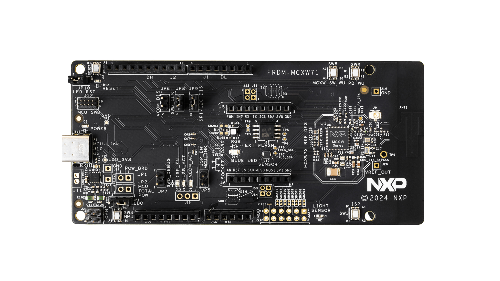
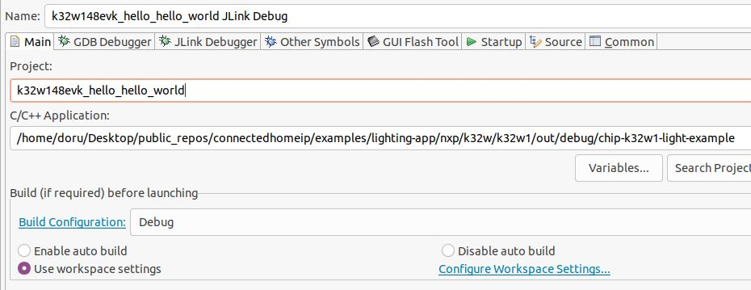

# Matter MCXW71 Lighting Example Application

For generic information related to on/off light application,
please see the [common README](../README.md).

- [Matter MCXW71 Lighting Example Application](#matter-mcxw71-lighting-example-application)
  - [Introduction](#introduction)
  - [Device UI](#device-ui)
  - [Building](#building)
    - [`SMU2` Memory](#smu2-memory)
    - [LED PWM](#led-pwm)
  - [Flashing](#flashing)
    - [Flashing the `NBU` image](#flashing-the-nbu-image)
    - [Flashing the host image](#flashing-the-host-image)
  - [Debugging](#debugging)
  - [Running RPC console](#running-rpc-console)
  - [OTA](#ota)

## Introduction

The following board was used when testing this Matter reference app
for a `mcxw71` device: 

## Device UI

The state feedback is provided through LED effects:

| widget | effect | description |
| ------ | ------ | ----------- |
| LED2 | short flash on (50ms on/950ms off) | The device is in an unprovisioned (unpaired) state and is waiting for a commissioner to connect. |
| LED2 | rapid even flashing (100ms period) | The device is in an unprovisioned state and a commissioner is connected via BLE. |
| LED2 | short flash off (950ms on/50ms off) | The device is fully provisioned, but does not yet have full network (Thread) or service connectivity. |
| LED2 | solid on | The device is fully provisioned and has full network and service connectivity. |
| RGB LED | on | The `OnOff` attribute of the `On/Off` cluster is `true` (simulating device turned on). |
| RGB LED | off | The `OnOff` attribute of the `On/Off` cluster is `false` (simulating device turned off). |

NOTE: `LED2` will be disabled when OTA is used. On K32W1 EVK board, `PTB0` is
wired to both `LED2` and CS (Chip Select) of the External Flash Memory.
Since the OTA image is stored in external memory, `LED2` operations will affect
OTA operation by corrupting packages and OTA will not work.

The user actions are summarised below:

| button | action | output |
| ------ | ------ | ------ |
| SW2 | short press | Enable BLE advertising |
| SW2 | long press | Initiate a factory reset (can be cancelled by pressing the button again within the factory reset timeout limit - 6 seconds by default) |
| SW3 | short press | Toggle attribute `OnOff` value |
| SW3 | long press | Clean soft reset of the device (takes into account proper Matter shutdown procedure) |

The example application provides a simple UI that depicts the state of the
device and offers basic user control. This UI is implemented via the
general-purpose LEDs and buttons built in the MCXW71 EVK board.

## Building

Manually building requires running the following commands:

```
user@ubuntu:~/Desktop/git/connectedhomeip$ cd examples/lighting-app/nxp/mcxw71
user@ubuntu:~/Desktop/git/connectedhomeip/examples/lighting-app/nxp/mcxw71$ gn gen out/debug
user@ubuntu:~/Desktop/git/connectedhomeip/examples/lighting-app/nxp/mcxw71$ ninja -C out/debug
```

Please note that running `gn gen out/debug` without `--args` option will use the default
gn args values found in `args.gni`.

After a successful build, the `elf` and `srec` files are found in `out/debug/`.
See the files prefixed with `chip-mcxw71-light-example`.

### `SMU2` Memory

Additional memory is provided to the application by moving some
Matter instances and global variables in the shared memory area
from `NBU` domain.

Note: These instances and global variables are placed in `SMU2` memory through name
matching in the application linker script. They should not be changed or, if
changed, the names must be updated in `k32w1_app.ld`. See
[k32w1_app.ld](../../../platform/nxp/mcxw71_k32w1/app/ldscripts/k32w1_app.ld)
for names and `SMU2` memory range size.

When compiling the application as an OT Full Thread Device (`chip_openthread_ftd=true`), using `use_smu2_static=true` gn arg will cause the following symbols to be moved to `SMU2` area:

| symbol name | file |
| ----------- | ---- |
| `gImageProcessor` | `OTAImageProcessorImpl.cpp` |
| `gApplicationProcessor` | `OTAHooks.cpp` |
| `Server::sServer` | `Server.cpp` |
| `ThreadStackManagerImpl::sInstance` | `ThreadStackManagerImpl.cpp` |

Additionally, using `use_smu2_dynamic=true` will cause the OpenThread
buffers to be dynamically allocated from a 13KB `SMU2` range
after a successful commissioning process.

`use_smu2_static` and `use_smu2_dynamic` are set to `true` in the default example.

### LED PWM

In the default configuration, the onboard RGB LED pins are configured as GPIO
pins. In order to enable the dimming feature, the pins need to be configured in
PWM mode and synced with channels of the `TPM` (Timer PWM Module). To enable
this feature, compile the application with: `chip_config_dimmable_led=true`

If the feature is enabled, the LED brightness can be controlled using `LevelControl` cluster
[commands](../../../../docs/guides/chip_tool_guide.md#step-7-control-application-data-model-clusters).

## Flashing

Two images must be written to the board: one for the host (CM33) and one for the
`NBU` (CM3).

The image needed on the host side is the one generated in `out/debug/` while the
one needed on the `NBU` side can be found in the downloaded NXP-SDK package at
path -
`middleware\wireless\ieee-802.15.4\bin\k32w1\k32w1_nbu_ble_15_4_dyn_matter.sb3`.

### Flashing the `NBU` image

`NBU` image should be written only when a new NXP-SDK is released.

[K32W148 board quick start guide](https://www.nxp.com/document/guide/getting-started-with-the-k32w148-development-platform:GS-K32W148EVK)
can be used for updating the `NBU/radio` core:

-   Section 2.5 – Get Software – install `SPSDK` (Secure Provisioning Command
    Line Tool)
-   Section 3.3 – Updating `NBU` for Wireless examples - use the corresponding
    .sb3 file found in the SDK package at path
    `middleware\wireless\ieee-802.15.4\bin\k32w1\`

### Flashing the host image

Host image is the one found under `out/debug/`. It should be written after each
build process.

If debugging is needed then jump directly to the [Debugging](#debugging)
section. Otherwise, if only flashing is needed then
[JLink](https://www.segger.com/downloads/jlink/) can be used:

-   Plug MCXW71 to the USB port (no need to keep the SW4 button pressed while
    doing this, e.g. ISP mode is not needed for host flashing)

-   Connect JLink to the device:
    ```bash
    JLinkExe -device MCXW71 -if SWD -speed 4000 -autoconnect 1
    ```

-   Run the following commands:
    ```bash
    reset
    halt
    loadfile chip-mcxw71-light-example.srec
    reset
    go
    quit
    ```

## Debugging

One option for debugging would be to use MCUXpresso IDE.

-   Drag-and-drop the zip file containing the NXP SDK in the "Installed SDKs"
    tab:


-   Import any demo application from the installed SDK:

```
Import SDK example(s).. -> choose a demo app (demo_apps -> hello_world) -> Finish
```


-   Flash the previously imported demo application on the board:

```
Right click on the application (from Project Explorer) -> Debug as -> JLink/CMSIS-DAP
```

After this step, a debug configuration specific for the MCXW71 board was created.
This debug configuration will be used later on for debugging the application
resulted after ot-nxp compilation.

-   Import Matter repo in MCUXpresso IDE as Makefile Project. Use _none_ as
    _Toolchain for Indexer Settings_:

```
File -> Import -> C/C++ -> Existing Code as Makefile Project
```


-   Replace the path of the existing demo application with the path of the MCXW71
    application:

```
Run -> Debug Configurations... -> C/C++ Application
```



## Running RPC console

To build example with RPC enabled, use the following gn command:
`gn gen out/debug --args='import("//with_pw_rpc.gni") treat_warnings_as_errors=false'`

The application runs an RPC server and processes events coming from an RPC
client. An example of an RPC client is the `chip-console`, which can be accessed
by running:
`chip-console --device /dev/tty.<SERIALDEVICE> -b 115200 -o pw_log.out`

The console should have already been installed in the virtual environment. From
the `chip-console`, a user can send specific commands to the device.

For button commands, please run `rpcs.chip.rpc.Button.Event(index)` based on the
table below:

| index | action |
| ----- | ------ |
| 0 | Start/stop BLE advertising |
| 1 | Factory reset the device |
| 2 | Application specific action (e.g. toggle LED) |
| 3 | Soft reset the device |

To reboot the device, please run `rpcs.chip.rpc.Device.Reboot()`.

## OTA

Please see [mcxw71 OTA guide](../../../../docs/guides/nxp/nxp_mcxw71_ota_guide.md).
